# PSoXide

<p align="center">
  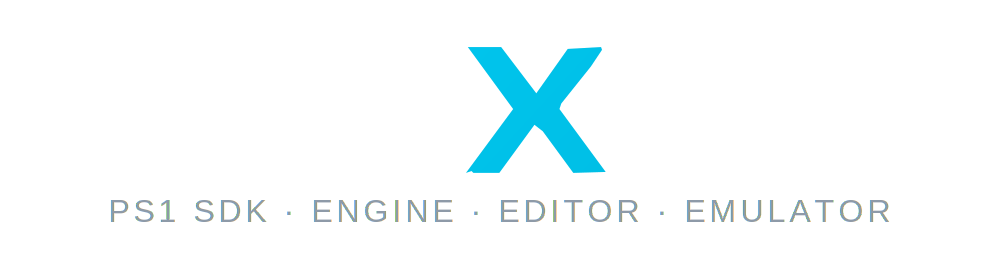
</p>

<p align="center">
  <a href="LICENSE"></a>
  
  
</p>

PSoXide is an open-source PlayStation 1 development stack written in
Rust. It is deliberately all of these pieces in one repository:

- a PS1 emulator and debugger frontend;
- a Rust-based PS1 homebrew SDK;
- a runtime engine for actual PS1 hardware;
- an asset pipeline and editor for rooms, entities, models, textures,
  animations, and playtesting;
- CUE/BIN disc-image builders for examples and authored projects.

The goal is not just "PS1-style" output. PSoXide builds real
PlayStation-compatible homebrew artifacts. Public examples and editor
projects can be exported as disc images that run in emulators or on
original hardware, while the same emulator frontend is used for
development, debugging, validation, and in-editor Play.

The current engine/editor direction is focused on the game being built
with it: a dark, third-person PS1 action-adventure / souls-like vertical
slice with room-grid worlds, low-poly characters, low-resolution
textures, and hardware-conscious runtime data. Broader engine features
may come later, but the immediate priority is shipping that vertical
slice and proving the full PS1 pipeline end to end.

This is still early software. It is useful, hackable, and moving fast,
but it is not a stable public SDK, not a general-purpose commercial game
engine, not a Godot fork, and not a tool for importing/editing existing
PS1 games.

Project page: <https://bonnie-games.itch.io/psoxide>

## Media

Editor and demos:

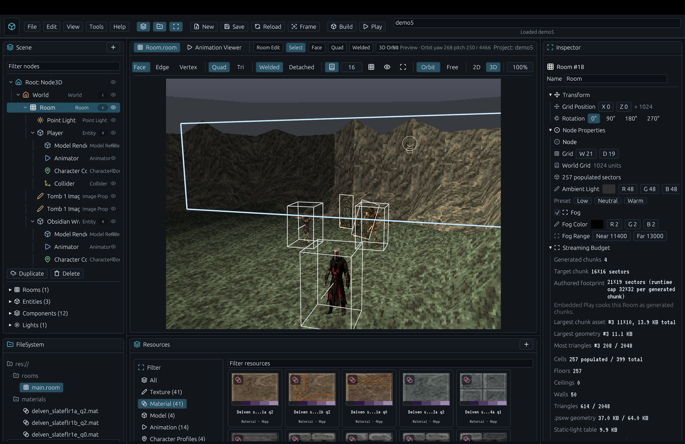

| Demo 2 In-Game | Demo 3 In-Game |
| --- | --- |
| 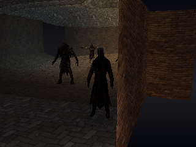 | 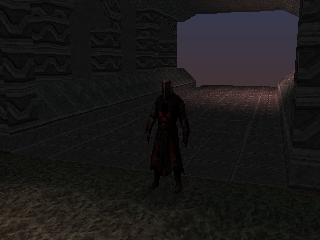 |

| Demo 4 In-Game | Demo 5 In-Game |
| --- | --- |
| 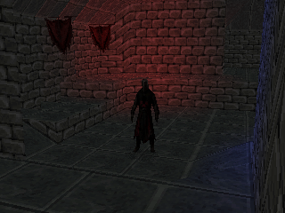 | 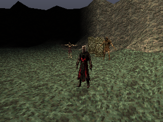 |

## Current Status

What works today:

- Emulator core for the major PS1 CPU, GTE, GPU, DMA, CD-ROM, SIO pad,
  timers, MDEC, and SPU paths needed by the current canaries.
- Desktop frontend built with winit, wgpu, egui, cpal, and gilrs.
- Debugger-style panels for registers, memory, VRAM, execution history,
  profiler data, savestates, library scanning, and game/example launching.
- BIOS boot canaries for logo/shell paths and commercial-disc boot
  canaries used as ignored regression tests.
- MIPS Rust SDK examples targeting `mipsel-sony-psx`, exported as
  PS1-compatible CUE/BIN discs.
- Runtime engine examples for sprites, text, 3D meshes, lighting, fog,
  particles, rooms, CD-DA playback, and small games.
- A streamed room runtime for editor playtests: compact collision
  payloads, prebuilt room render caches, room-chunk residency,
  CD-sector packing, and 60 Hz simulation with paced visual frames.
- `psxed` content pipeline for cooked texture, mesh, model, animation,
  and room/world artifacts.
- Editor project model with scene tree, resources, inspectors, 2D/3D
  viewports, room-grid authoring, materials, lights, model placement,
  and a playable character resource.
- One-click editor Play mode: the editor saves and cooks the active
  project, builds the internal `editor-playtest` PSX EXE, packages a
  raw disc image with streamed room chunks, boots that disc through the
  HLE BIOS path without requiring a user BIOS, and displays the live
  game framebuffer inside the editor's 3D viewport.
- Headless project export with `frontend build-project-disc`, producing
  a project-local `baked/*.cue` + `.bin` pair.
- Exact-hash validation manifests for repeatable display/VRAM regression
  checks.
- Headless profiling and screenshot capture for geometry-heavy
  playtests, including streamed demo3 frame pacing and CD-room-load
  telemetry.

What is not done:

- General commercial-game compatibility is incomplete. Timing drift and
  long-tail peripheral behavior are still active emulator research.
- Audio is still comparatively immature. CD-DA works in targeted demos,
  but SPU reverb, broader SPU edge cases, and richer runtime audio APIs
  need more completeness work.
- More peripherals, memory cards, and edge-case GPU behavior need more
  coverage.
- The editor is a prototype. It has real project/cook/play flow, but
  needs project templates, import UX, richer validation, undo depth,
  packaging, and more stable authoring ergonomics.
- The SDK and engine APIs are not semver-stable.
- Data formats are still changing while the runtime is optimized around
  real PS1 constraints.
- No stable release binaries are published yet. Build from source.

## Quick Start

### 1. Install dependencies

Verified path on macOS:

```bash
xcode-select --install
curl --proto '=https' --tlsv1.2 -sSf https://sh.rustup.rs | sh
```

Then open a new shell. The repo's `rust-toolchain.toml` pins nightly and
asks rustup for `rustfmt`, `clippy`, `rust-src`, and `llvm-tools`.
The top-level workflow uses `make`; on macOS the Command Line Tools
install `/usr/bin/make`.

On Debian/Ubuntu-style Linux hosts, install the native packages the
frontend stack usually needs:

```bash
sudo apt install build-essential make pkg-config libasound2-dev libudev-dev \
  libx11-dev libxi-dev libxrandr-dev libxinerama-dev libxcursor-dev \
  libxkbcommon-dev libwayland-dev mesa-vulkan-drivers
```

Windows is not documented as a first-class path yet.

### 2. Clone and check the repo

```bash
git clone https://github.com/EBonura/PSoXide.git psoxide
cd psoxide
make check
make test
```

The fast defaults do not require commercial games or PCSX-Redux.
Canaries and parity tests are ignored by default.

### 3. Build and boot a homebrew example

Homebrew examples do not require a retail BIOS. They build through the
Rust PSX target, package a PS1-compatible disc image, and boot through
PSoXide's HLE BIOS path:

```bash
make hello-tri-disc
make run-tri
```

To build the public example set:

```bash
make examples
```

The generated CUE/BIN/EXE artifacts live under:

```text
build/examples/mipsel-sony-psx/release/
```

### 4. Configure a BIOS for retail discs

PSoXide does not include a PlayStation BIOS and will not download one
for you. The bundled homebrew examples and editor Play flow do not need
a user BIOS; they use PSoXide's HLE BIOS path and can run from a fresh
checkout once built.

A real BIOS is still required for retail/commercial disc boot, BIOS boot
canaries, and parity work against PCSX-Redux. Dump your own BIOS image,
then configure it in either place:

- In the frontend UI, open the Menu Settings column and use
  **Choose BIOS path**. This persists `paths.bios` in `settings.ron`.
- For headless or shell-only workflows, export `PSOXIDE_BIOS`:

```bash
export PSOXIDE_BIOS=/absolute/path/to/SCPH1001.BIN
```

When both are set, the saved `settings.ron` path takes precedence over
the environment variable.

Only use BIOS images and game disc images you legally own.

### 5. Launch the frontend

```bash
make run
```

Useful options:

```bash
cd emu
cargo run -p frontend --release -- --windowed
cargo run -p frontend -- info
cargo run -p frontend -- scan --root /path/to/games
cargo run -p frontend -- list
```

### 6. Open the editor

Launch the frontend, then use the Menu Create column to open the editor
workspace. The default project lives at:

```text
editor/projects/default/project.ron
```

Editor Play workflow:

1. Open the editor workspace.
2. Edit the scene/resources.
3. Click Play in the editor controls.
4. The frontend saves the project, cooks generated assets into
   `engine/examples/editor-playtest/generated/`, runs
   `make build-editor-playtest`, builds a playtest disc image, and boots
   `build/examples/mipsel-sony-psx/release/editor-playtest.bin`.
5. The editor 3D viewport switches from editable preview to the live PSX
   framebuffer.
6. Click the viewport to capture input for the game.
7. Press Escape or Select+Start to release capture; press Stop to return
   to the editable preview.

Default keyboard pad bindings:

| PSX Control | Keyboard |
| --- | --- |
| D-pad | Arrow keys |
| Left stick | Arrow keys |
| Right stick | I / J / K / L |
| Cross | X |
| Circle | C |
| Square | Z |
| Triangle | S |
| L1 / R1 | Q / E |
| L2 / R2 | 1 / 3 |
| Start / Select | Enter / Backspace |
| Analog toggle | F9 |

For the editor-playtest third-person movement work, press F9 to toggle
DualShock analog mode. Circle is run.

### 7. Export an authored project disc

The headless frontend can cook an editor project, build the PSX runtime,
package the streamed room data, and copy the resulting CUE/BIN pair into
the project's ignored `baked/` directory:

```bash
cargo run --manifest-path emu/Cargo.toml -p frontend --release -- \
  build-project-disc --project editor/projects/default
```

For a quick editor-preview render without opening the GUI:

```bash
cargo run --manifest-path emu/Cargo.toml -p frontend --release -- \
  dump-editor-preview --project editor/projects/default --out /tmp/psoxide-preview.ppm
```

## Build Targets

The Makefile is the source of truth; run `make help` for the exhaustive
list. The main public targets are:

```bash
make check      # cargo check across root/editor/emu/engine/sdk/tools
make test       # fast non-ignored tests
make fmt        # rustfmt across every workspace/tool
make lint       # clippy -D warnings across every workspace/tool
make clean      # cargo clean across workspaces/tools and remove build/
make validate   # exact-hash validation matrix
```

Optional emulator parity and compatibility checks:

```bash
make canaries                 # ignored BIOS/commercial-disc canaries
make commercial-visual-guards # local visual guards for owned disc images
make parity                   # compare trace output against the oracle path
make oracle-smoke             # verify the parity oracle can run
make oracle-side-load         # compare SDK side-loaded EXEs against oracle
make oracle-disc-smoke        # compare a local disc checkpoint against oracle
make validate-repeat          # run validation repeatedly for determinism
make validate-bless           # update validation baselines
```

SDK, engine, and demo builds:

```bash
make examples      # build every public SDK/engine/game example disc
make test-sdk      # build SDK examples and run SDK regression coverage
make psxed         # build the content-pipeline CLI
make assets        # cook shared source assets via psxed
make hello-tri     # build one SDK example
make showcase-model # build one engine showcase
make game-pong     # build one mini-game
make game-magikaaaaaarp-pong-disc # build magikAAAAArp Pong with CD-DA
make run-tri       # build and boot an example disc in the frontend
```

The frontend's Examples menu uses artifacts from
`build/examples/mipsel-sony-psx/release/`. On a fresh clone, use
`make examples` or choose **Build public examples** in the Examples
menu, then the launcher will rescan and populate the list.

Headless frontend commands:

```bash
cargo run --manifest-path emu/Cargo.toml -p frontend --release -- info
cargo run --manifest-path emu/Cargo.toml -p frontend --release -- scan --root discs
cargo run --manifest-path emu/Cargo.toml -p frontend --release -- launch --path build/examples/mipsel-sony-psx/release/hello-tri.cue
cargo run --manifest-path emu/Cargo.toml -p frontend --release -- build-project-disc --project editor/projects/default
cargo run --manifest-path emu/Cargo.toml -p frontend --release -- validate --manifest validation/suite.ron
```

Editor/playtest internals:

```bash
make cook-playtest          # cook starter or PROJECT=/path/project.ron
make build-editor-playtest  # build whatever is currently generated
make profile-demo3          # cook/build/boot streamed demo3, dump screenshot/profile
make profile-demo3-forward  # same, while holding forward
make profile-demo3-paced20  # paced visual telemetry alias for streamed demo3
make profile-demo3-disc-stream # explicit CD-stream benchmark path
make profile-demo7-camera-sweep # deterministic demo7 camera sweep with guest profile
```

`make cook-playtest` is destructive for
`engine/examples/editor-playtest/generated/`; the editor Play action
normally owns that directory. The profile targets additionally build a
raw `.bin` disc image through `tools/mkisopsx` and boot that image in
the emulator frontend. Editor Play uses PSoXide's HLE BIOS path, so it
does not require a configured user BIOS.
The camera-sweep profile builds the playtest with `PSXO_CAMERA_SWEEP=1`
and room/model micro-profiling enabled, then dumps the guest stage
breakdown, a final hardware-render PPM, and visual-frame hashes under
`/tmp`.

## Examples

The repo ships runnable examples that double as the de-facto test suite
for the SDK and engine. Each builds for `mipsel-sony-psx` and runs
end-to-end through the emulator frontend (`make <name>-disc` to build a
disc, `make run-<name>` where supported).

| `hello-tri` | `hello-tex` | `hello-input` |
| --- | --- | --- |
| 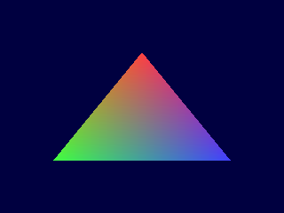 | 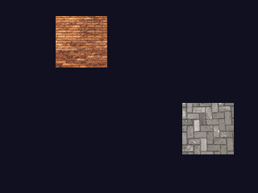 | 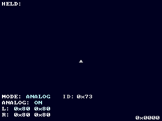 |

| `hello-audio` | `hello-ot` | `showcase-3d` |
| --- | --- | --- |
| 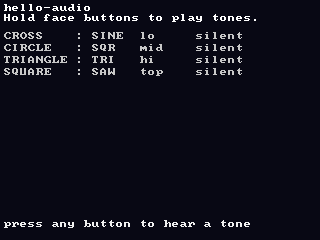 | 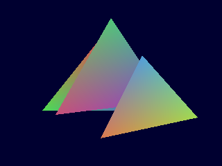 | 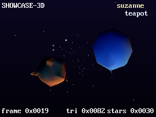 |

| `showcase-fog` | `showcase-lights` | `showcase-model` |
| --- | --- | --- |
| 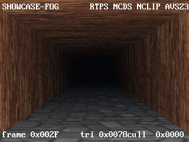 | 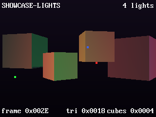 | 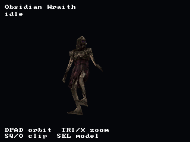 |

| `showcase-particles` | `showcase-text` |
| --- | --- |
| 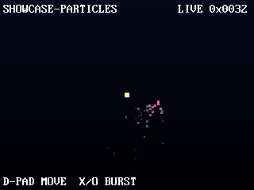 | 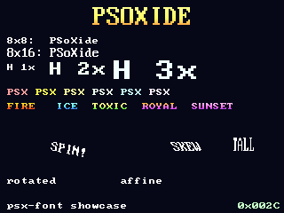 |

| `game-pong` | `game-magikaaaaaarp-pong` | `game-breakout` | `game-invaders` |
| --- | --- | --- | --- |
| 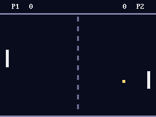 | 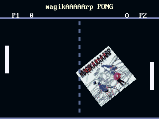 | 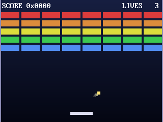 | 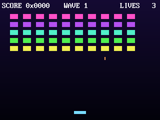 |

### SDK examples - bare-metal MIPS, no engine framework

| Example | What it demonstrates |
| --- | --- |
| `hello-tri` | Smallest interesting homebrew. GPU init, framebuffer clear, one Gouraud triangle per frame with a time-based wobble. Proves the EXE loader, render loop, and basic GPU primitives. |
| `hello-tex` | 4bpp CLUT texture upload + animated bouncing sprites. Exercises the full texture pipeline: editor cooker (`psxed tex`) → cooked `.psxt` blobs → VRAM upload → sprite render. |
| `hello-input` | Polls the port-1 pad every frame and renders feedback that reacts to held buttons. Proves SIO0 + pad and ASCII text rendering through `psx-font`. |
| `hello-audio` | Four face buttons trigger four SPU voices with different built-in waveforms and pitches. Smallest end-to-end SPU demo. |
| `hello-ot` | Three overlapping Gouraud triangles depth-sorted via an ordering table and DMA channel 2 in linked-list mode, the same path commercial games use. |

### Engine examples - built on the `psx-engine` Scene/App framework

**Showcases**

| Example | What it demonstrates |
| --- | --- |
| `showcase-3d` | Flagship 3D demo. Suzanne (decimated to ~180 tris) and Utah teapot rendered with GTE NCCS hardware lighting under three directional lights. |
| `showcase-fog` | Full PS1-commercial GTE + textured-poly pipeline: per-vertex RTPS projection, NCLIP back-face cull, AVSZ3 ordering-table insertion, and depth-cue fog. |
| `showcase-lights` | Four coloured moving point lights illuminating scaled cubes. Complementary to `showcase-3d`, point-light path vs. directional. |
| `showcase-model` | Animated-model demo. Two characters sharing a 24-joint biped rig; D-pad orbits the camera, Square/Circle steps through animation clips, Select swaps character. |
| `showcase-particles` | Fixed-pool particle effects through the engine's ordering-table helpers. Routes `psx-fx` simulations through the same render path as the GTE-heavy showcases. |
| `showcase-text` | Tour of every text-rendering capability of the `psx-font` crate: 8×8 and 8×16 IBM VGA fonts, gradient title, multi-font comparison, palette tricks. |

**Mini-games**

| Example | What it demonstrates |
| --- | --- |
| `game-pong` | Two-paddle Pong, first full game ported to the engine framework. Left = D-pad, right = AI with hysteresis band, first to 7 wins. |
| `game-magikaaaaaarp-pong` | magikAAAAArp-themed Pong with a comically large rotating album cube as the ball, a baked GONCHAROV spectrum visualizer, and "GONCHAROV" streamed as CD-DA track 2. Left = D-pad, right = AI, first to 5 wins. |
| `game-breakout` | Brick-buster. 40-brick rainbow wall, gradient background, particle bursts on break, ball trail, screen shake. |
| `game-invaders` | Space Invaders. 5×10 marching alien grid that speeds up as the formation thins, player bullet + up to 4 enemy bombs, wave progression. |

## Repository Layout

```text
.
├── crates/                 shared no_std-compatible PSX primitives
├── editor/                 editor UI, project model, cook pipeline, psxed CLI
├── emu/                    emulator core, frontend, settings, parity oracle
├── engine/                 PSX runtime engine crates and examples
├── sdk/                    PSX SDK crates and bare-metal examples
├── tools/                  standalone utilities
├── assets/                 branding and shared cooked demo assets
└── Makefile                top-level quality and example commands
```

Generated contract:

- `engine/examples/editor-playtest/generated/level_manifest.rs` is a
  tracked placeholder so the runtime template builds from a clean tree.
- Cooked generated manifests, rooms, textures, models, and built EXEs
  are ignored and regenerated by editor Play or `make cook-playtest`.
- PSX target/linker flags for examples are owned by the top-level
  `Makefile`; local `.cargo/` config directories are intentionally
  ignored.
- `/build/` is an output directory, not source.

## External Files

Not included and intentionally ignored:

- PlayStation BIOS images. Put local dumps under `bios/` or configure
  an absolute path in the frontend settings.
- Commercial game disc images. Put local owned dumps under `discs/` or
  scan another path from the frontend/CLI.
- PCSX-Redux binaries or source trees.
- Large original texture/model/audio sources beyond the small committed
  demo inputs. Keep import experiments under `local-assets/`.

Ignored tests and parity tools may require:

- `PSOXIDE_BIOS=/path/to/bios.bin`
- `PSOXIDE_REDUX_BIN=/path/to/patched/pcsx-redux`,
- a local PCSX-Redux build from the PSoXide oracle branch,
- local game images you legally own.

PSoXide does not include or download Sony BIOS files or commercial game
data. Do not redistribute BIOS images or game dumps with projects built
from this repo.

## License

PSoXide is licensed under the **GNU General Public License, version 2
or (at your option) any later version**. The full license text is in
[LICENSE](LICENSE); third-party references and provenance notes are in
the same file.

The GPL choice is deliberate: the emulator core builds on PCSX-Redux
as a parity oracle and reference, and PCSX-Redux is GPL-2.0-or-later.
Releasing PSoXide under the same license keeps the lineage clean.

Asset provenance is tracked in
[`docs/asset-provenance.md`](docs/asset-provenance.md). Third-party
reference notes and non-redistribution notices live in `LICENSE`.
